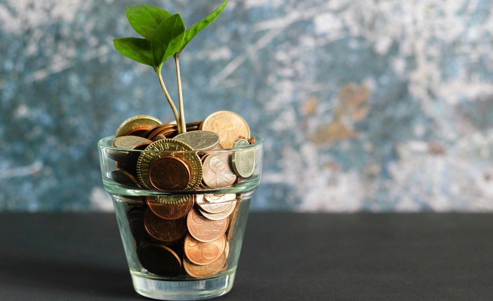
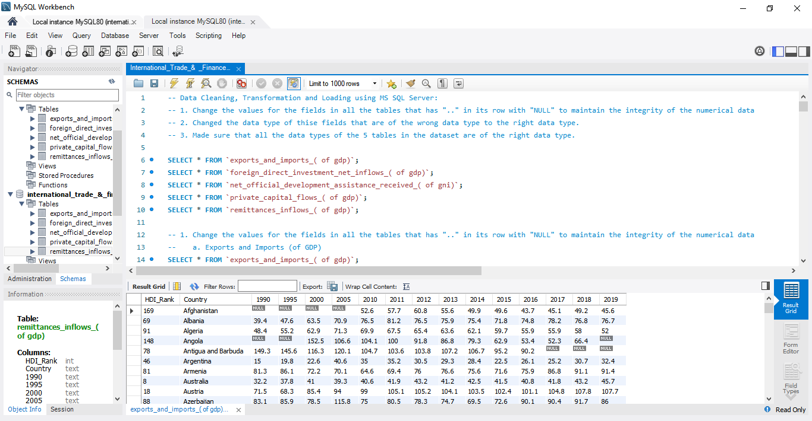
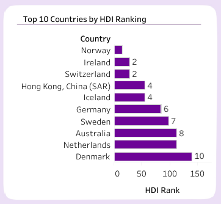

# International Trade And Finance Analysis

 

## Project Overview
### Introduction:
The “International Trade and Finance Analysis” project will look into global trade and financial flows using UNDP data. This will focus on key indicators to understand country to country economic relationships. The data involves Historical Trade and Finance Data for 190+ countries by UNDP

## Objectives:
The primary objectives of this project are to:
- __Top Performers:__ Analyze and rank top 10 countries based on Exports & Imports and HDI ranking, trade dependency, investment attractiveness, aid dependency, remittance to GDP and private investment efficiency.
- __Trend:__ Show trend of trade dependency, investment attractiveness and private investment efficiency over time as a percentage of GDP.
- __Correlation:__ Correlate HDI with trade and finance indicators.
- __Policy and Strategy:__ Provide policy recommendations to improve economic performance, trade and financial stability.

### Methodology:
The analysis will involve:
- Pulling data from the UNDP database.
- Running stats to find trends, correlations and changes over time.
- Ranking countries based on the selected indicators.
- Comparing countries and regions based on performance.
- Visualizing the data through graphs and chart to draw insights.

### Expected Outcomes
The project aims to:
- __Top 10 Countries Rankings:__
    - Show top 10 countries by Exports & Imports HDI Ranking.
    - Show top 10 countries by Trade Dependency.
    - Show top 10 countries by Investment Attractiveness.
    - Show top 10 countries by Aid Dependency.
    - Show top 10 countries by Remittance Contribution to GDP.
    - Show top 10 countries by Private Investment Efficiency.
- __Trend Analysis:__
    - Trade Dependency Trend by Year (% of GDP).
    - Investment Attractiveness Trend by Year (% of GDP).
    - Private Investment Efficiency Trend by Year (% of GDP).
- __Human Development Index Correlation:__
    - Correlation between countries’ HDI ranking and trade and finance indicators.
- __Policy Recommendations:__
    - Insights and policy recommendations to improve trade efficiency, economic performance and financial stability.
 

### About The Dataset
This analysis uses the UNDP’s data for the ‘Trade and Finance flows’ dimension. The data came with 5 tables which are: Exports and Imports (% of GDP), Foreign Direct Investment, Net Inflows (% of GDP), Net Official Development Assistance Received (% of GNI), Private Capital Flows (% of GDP), and Remittances, Inflows (% of GDP). The main data indicators looked at are:

- __Exports and Imports (% of GDP):__ Value of goods and services a country exports and imports as a percentage of its GDP, to show trade openness and economic integration with the global market.
- __Foreign Direct Investment, Net Inflows (% of GDP):__ Net inflows of investment to acquire a lasting interest or significant influence over a company’s management in another country, to show economic globalization and confidence in a country’s economy.
- __Net Official Development Assistance Received (% of GNI):__ Net official aid provided by donor countries to promote economic development and welfare in recipient countries, as a percentage of Gross National Income (GNI), to show support and dependency of developing countries on foreign aid.
- __Private Capital Flows (% of GDP):__ Movement of private capital in and out of the country, including investments in stocks, bonds and other financial assets, as a percentage of GDP, to show private investors’ confidence in the country’s economy.
- __Remittances, Inflows (% of GDP):__ Total value of money sent back home by nationals working abroad as a percentage of GDP, which is a major source of income for many developing countries and household income and economic stability.

This data is for 2019, which may be the latest data published by UNDP. The dataset used for this analysis project was sourced from Kaggle.com. [Here](https://www.kaggle.com/datasets/elmartini/international-trade-and-finance-data) is a link to the dataset. The dataset used for this anaysis can also be downloaded directly from [here](Data).
 
 

### Skills Utilized
1. Data Cleaning
2. Data Modelling
3. Data Visualiziation
4. Descriptive Analytics
5. Critical Thinking and Problem Solving
6. Communication and Reporting
 

### Tools Used
1. MySQL
    - Was used to:
        1. Extract,
        2. Clean,
        3. Transform,
        4. Load all the datasets for this analysis.

2. Tableau (Was used to create dashboards for this analysis)
    - The following Tableau tools were incorporated:
        1. Calculated Fields
        2. Geospatial Analysis
        3. Page Navigation
        4. Filters
        5. Tooltips
        6. Buttons
 

### Data Cleaning, Transformation and Loading using MS SQL Server:
-- Data was majorly clean from source. I just had to do some cleaning in MySQL for everything to work fine, and they are:
-- 1. Changed the values for the fields in all the tables that has ".." in its row with "NULL" to maintain the integrity of the numerical data
-- 2. Changed the data type of thise fields that are of the wrong data type to the right data type.
-- 3. Made sure that all the data types of the 5 tables in the dataset are of the right data type.
 

**MySQL View**

Sql Query Screenshot                                                               |                                
:---------------------------------------------------------------------------------:|
    

You can preview the SQL query file [here](International_Trade_%26%20_Finance_Analysis_Project.sql)
 
 

## Visualization in Tableau:
#### Report View 1

#### Report View 2

 
 

### Project Analysis:
From the analysis, i made the following Key findings below:
- Aid Dependency (%): __4.50__
- Investment Attractiveness (%): __6.73__
- Private Investment Efficiency: __-2.83__
- Trade Dependency (%): __79.30__
- Remittance Contribution to GDP (%): __3.89__
 
 

- 

- **Top 10 Countries By Human Development Index (HDI) Ranking:**
- The top 10 countries that rank high in HDI are Norway, Ireland, Switzerland, Hong Kong (China SAR), Iceland, Germany, Sweden, Australia, the Netherlands and Denmark. Norway is number one because of its strong economy, high standard of living and good healthcare and education. Ireland and Switzerland are second because of high income and advanced social systems. Hong Kong and Iceland are tied at 4th because they have the same level of human development despite different economic contexts. 8 out of the 10 are European, so Europe is top in human development. They have different economic models, from Norway’s resource based economy to Switzerland’s finance based economy but all have high scores in life expectancy, education and income.
  
- These top countries can be a model for policy making, highlighting the importance of healthcare, education and social security in human development. High HDI means stable investment climate, opportunities in tech, finance and healthcare. The correlation between high HDI and sustainable economy means sustainable development policies are valuable. Knowing the factors behind high HDI can help other countries identify and develop their competitive advantages in the global market. High HDI means economic and social stability, important for long term planning for businesses and governments, so investing in human development for overall economic success.
