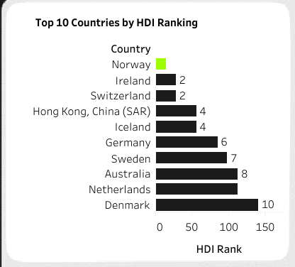
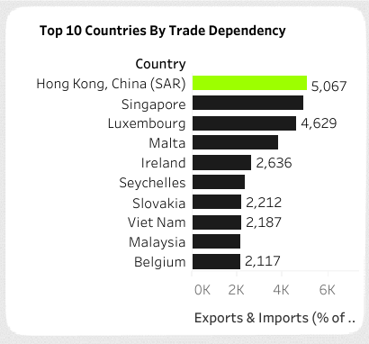
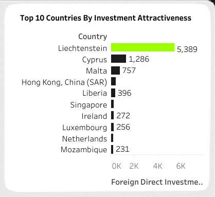
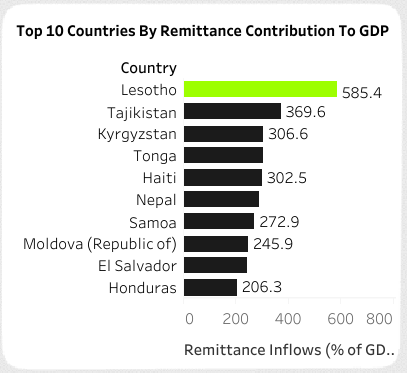

# International Trade And Finance Analysis

 

## Table of Contents
- [Project Overview](#project-overview)
- [About The Dataset](#about-the-dataset)
- [Tools Used](#tools-used)
- [Visualization in Tableau](#visualization-in-tableau)
- [Project Analysis](#project-analysis)
- [Tableau Dashboard Visualization](#tableau-dashboard-visualization)  
- [Recommendations for Enhancing Trade and Investment Efficiency](#recommendations-for-enhancing-trade-and-investment-efficiency)
 

## Project Overview
### Introduction:
The “International Trade and Finance Analysis” project will look into global trade and financial flows using UNDP data. This will focus on key indicators to understand country to country economic relationships. The data involves Historical Trade and Finance Data for 190+ countries by UNDP

## Objectives:
The primary objectives of this project are to:
- __Top Performers:__ Analyze and rank top 10 countries based on Exports & Imports and HDI ranking, trade dependency, investment attractiveness, aid dependency, remittance to GDP and private investment efficiency.
- __Trend:__ Show trend of trade dependency, investment attractiveness and private investment efficiency over time as a percentage of GDP.
- __Correlation:__ Correlate HDI with trade and finance indicators.
- __Policy and Strategy:__ Provide policy recommendations to improve economic performance, trade and financial stability.

### Methodology:
The analysis will involve:
- Pulling data from the UNDP database.
- Running stats to find trends, correlations and changes over time.
- Ranking countries based on the selected indicators.
- Comparing countries and regions based on performance.
- Visualizing the data through graphs and chart to draw insights.

### Expected Outcomes
The project aims to:
- __Top 10 Countries Rankings:__
    - Show top 10 countries by Exports & Imports HDI Ranking.
    - Show top 10 countries by Trade Dependency.
    - Show top 10 countries by Investment Attractiveness.
    - Show top 10 countries by Aid Dependency.
    - Show top 10 countries by Remittance Contribution to GDP.
    - Show top 10 countries by Private Investment Efficiency.
- __Trend Analysis:__
    - Trade Dependency Trend by Year (% of GDP).
    - Investment Attractiveness Trend by Year (% of GDP).
    - Private Investment Efficiency Trend by Year (% of GDP).
- __Human Development Index Correlation:__
    - Correlation between countries’ HDI ranking and trade and finance indicators.
- __Policy Recommendations:__
    - Insights and policy recommendations to improve trade efficiency, economic performance and financial stability.
 

### About The Dataset
This analysis uses the UNDP’s data for the ‘Trade and Finance flows’ dimension. The data came with 5 tables which are: Exports and Imports (% of GDP), Foreign Direct Investment, Net Inflows (% of GDP), Net Official Development Assistance Received (% of GNI), Private Capital Flows (% of GDP), and Remittances, Inflows (% of GDP). The main data indicators looked at are:
- __Exports and Imports (% of GDP):__ Value of goods and services a country exports and imports as a percentage of its GDP, to show trade openness and economic integration with the global market.
- __Foreign Direct Investment, Net Inflows (% of GDP):__ Net inflows of investment to acquire a lasting interest or significant influence over a company’s management in another country, to show economic globalization and confidence in a country’s economy.
- __Net Official Development Assistance Received (% of GNI):__ Net official aid provided by donor countries to promote economic development and welfare in recipient countries, as a percentage of Gross National Income (GNI), to show support and dependency of developing countries on foreign aid.
- __Private Capital Flows (% of GDP):__ Movement of private capital in and out of the country, including investments in stocks, bonds and other financial assets, as a percentage of GDP, to show private investors’ confidence in the country’s economy.
- __Remittances, Inflows (% of GDP):__ Total value of money sent back home by nationals working abroad as a percentage of GDP, which is a major source of income for many developing countries and household income and economic stability.

This data is for 2019, which may be the latest data published by UNDP. The dataset used for this analysis project was sourced from Kaggle.com. [Here](https://www.kaggle.com/datasets/elmartini/international-trade-and-finance-data) is a link to the dataset. The dataset used for this anaysis can also be downloaded directly from [here](Data).
 
 

### Skills Utilized
1. Data Cleaning
2. Data Modelling
3. Data Visualiziation
4. Descriptive Analytics
5. Critical Thinking and Problem Solving
6. Communication and Reporting
 

### Tools Used
1. MySQL
    - Was used to:
        1. Clean
        2. Transform all datasets for this analysis.

2. Tableau (Was used to create dashboards for this analysis)
    - The following Tableau tools were incorporated:
        1. Calculated Fields
        2. Geospatial Analysis
        3. Page Navigation
        4. Filters
        5. Tooltips
        6. Buttons
 

### Data Cleaning, Transformation and Loading using MS SQL Server:
Data was mostly clean from source. I had to do some cleaning in MySQL for everything to work fine, and the steps i took are:
- Changed the values for the fields in all the tables that has ".." in its row with "NULL" to maintain the integrity of the numerical data
- Changed the data type of the fields that are of the wrong data type to the right data type.
- Made sure that all the data types of the 5 tables in the dataset were of the right data type.
 

**MySQL View**

Sql Query Screenshot                                                               |                                
:---------------------------------------------------------------------------------:|
    

You can preview the SQL query file [here](International_Trade_%26%20_Finance_Analysis_Project.sql)
 
 

## Visualization in Tableau:
#### Report View 1

#### Report View 2

 
 

### Project Analysis:
From the analysis, i made the following Key findings below:
- Aid Dependency (%): __4.50__
- Investment Attractiveness (%): __6.73__
- Private Investment Efficiency: __-2.83__
- Trade Dependency (%): __79.30__
- Remittance Contribution to GDP (%): __3.89__
 
 

- 

- **Top 10 Countries By Human Development Index (HDI) Ranking:**
- The top 10 countries which have high ranks in HDI are Norway, Ireland, Switzerland, Hong Kong (China SAR), Iceland, Germany, Sweden, Australia, Netherlands, and Denmark. Norway stands at number one due to its strong economy, high living standards with good health care, and education. Ireland and Switzerland stand second due to their high income with very advanced social systems. Hong Kong and Iceland are both in 4th place because they have the same level of human development but it differs economically. Of the 10, 8 belong to Europe, so it comes out the top in humans development. They have alternative economic models; Norway with a resource-based economy; Switzerland purely based on finance; all of them having top scores in life expectancy, education, and income.
  
- Such leading countries can be a model for policy-making, insisting on the three areas of human development: health care, education, and social security. High HDI would reflect a stable investment climate, showing potential opportunities for technology, finance, and health sectors. Since high HDI goes hand in hand with an economically sustainable country, it is valued by the sustainable development policies. Knowing how high HDI factors would help other countries identify and work on their competitive advantages within the global market. High HDI pertains to a country that is economically and socially stable; therefore, it is important for any long-term planning by businesses and governments.
 
 

- 

- **Top 10 Countries By Trade Dependency:**
- Here are the top 10 countries by trade dependency, measured by the sum of exports and imports as a percentage of GDP. Small open economies with high trade activity dominate the list. Hong Kong, China (SAR) is top with 5,067% of GDP, followed by Singapore 4,916% and Luxembourg 4,629%. These are major global trade hubs, with strategic locations and well developed infrastructure for international trade. Malta, Ireland and Seychelles also have high trade dependency, they rely on trade for their economic growth. Slovakia, Viet Nam, Malaysia and Belgium complete the list with trade dependency above 2,000% of GDP, they are deeply integrated in global supply chains and markets. 

- High trade dependency in these countries means international trade plays a big role in their economies. For policymakers, understanding global trade is key to economic growth and stability. These countries’ success is often linked to attracting foreign investments, competitive export industries and good trade policies. But high dependency also makes them vulnerable to global economic downturns, trade disputes and changes in international trade policies. Diversifying their economies and domestic markets can help mitigate these risks. For investors, these trade dependent countries offers many opportunities especially in sectors like logistics, manufacturing and finance which benefits from high trade volumes. Focus on trade infrastructure and policies can make them even more attractive as global trade hubs.
 
 

- 

- **Top 10 Countries By Investment Attractiveness:**
- The top 10 countries by investment attractiveness, by net FDI inflows as a % of GDP are: Liechtenstein 5,389%, Cyprus 1,286%, Malta 757%, Hong Kong, China (SAR) 426%, Liberia 396%, Singapore 289%, Ireland 272%, Luxembourg 256%, Netherlands 243%, Mozambique 231%. They all have good tax regimes, great locations and business friendly environments.

- High FDI ratios mean these countries are hot for global investors. Liechtenstein is number one because of its tax regime. Cyprus and Malta because of their location and tax breaks. Hong Kong and Singapore because they are financial hubs. Liberia and Mozambique because of their growth potential. Keeping investor friendly environments and stable politics is key to sustaining FDI and investment opportunities in finance, real estate and emerging industries.
 
 

- 

- **Top 10 Countries By Aid Dependency:**
- The top 10 countries by aid dependency, as measured by net official development assistance received as a percentage of Gross National Income (GNI), are heavily reliant on aid for their economies. Tuvalu is at the top with 492.3% of GNI, followed by Micronesia with 374.1% and the Solomon Islands with 354.1%. Liberia and the Marshall Islands are also high on the list with 323.6% and 315.3% respectively. Burundi, Kiribati, Malawi, Nauru and Afghanistan complete the list with aid dependency above 200%. These numbers mean aid is a lifeline for these countries’ economies and development efforts.

- High aid dependency ratios show how important foreign aid is for these countries’ economies, often because of limited domestic resources and economic challenges. For example Tuvalu’s aid dependency is because of its small size and no natural resources. Liberia and Afghanistan depend heavily on aid because of prolonged conflicts and political instability. While aid is necessary for immediate economic support and development projects, it also means we need to think of strategies to reduce dependency over time. Strengthening local economies, good governance and sustainable development are key to reducing aid dependency. 
 
 

- 

- **Top 10 Countries By Remittance Contribution to GDP:**
- In this analysis, we have the top 10 countries by remittance to GDP. Lesotho leads the pack with remittances at 585.4% of GDP, followed by Tajikistan at 369.6%, Kyrgyzstan at 306.6%, Tonga at 304.2%, Haiti at 302.5%, Nepal at 252.4%, Samoa at 243.8%, Moldova at 232.4%, El Salvador at 225.5% and Honduras at 214.5%. These numbers show how big a deal remittances are for these countries, often bigger than other sources of income.

- High remittance numbers means these countries are dependent on their expats for economic survival. For Lesotho and Tajikistan, remittances are a big chunk of their GDP, meaning limited domestic economic opportunities and the diaspora is crucial. While remittances can be a steady source of income and improve living standards, it also makes these economies vulnerable to global economic shifts and changes in migration policies. 
 
 

- 

- **Top 10 Countries By Private Investment Effciency:**
- The top 10 countries by private investment efficiency (private capital flows as a percentage of GDP) are Timor-Leste with 780.9%, Kuwait with 249.3%, Norway with 108.0%. The Netherlands and Switzerland with 92.0% and 90.8% respectively. Hong Kong, China (SAR), Greece, Qatar, Germany and Singapore also make the list with private capital flows ranging from 80.0% to 57.2% of GDP. These high numbers mean these countries are good at attracting and managing private investments.

- Timor-Leste’s high private capital flows are due to its special investment dynamics, possibly because of its oil and gas revenues. Kuwait’s high number is because of its strong financial sector and oil wealth. Norway, the Netherlands and Switzerland have stable high income economies with deep financial markets. Hong Kong and Singapore are financial hubs that attract big private investments because of their location and business friendly environment. Greece and Qatar are countries with strong investment activities despite different economic structures. These countries have policies that create good investment climate, low taxes, political stability and strong regulatory framework.
 
 

- 

- **Trade Dependency Trend By Year (% of GDP):**
- The trade dependency trend, measured by the sum of exports and imports as a percentage of GDP, shows an upward slope from 1990 to 2012 and then fluctuations and a decline in 2019. From 10,541% of GDP in 1990 to 12,730% in 1995, 14,283% in 2000 and 16,890% in 2012, trade dependency increased steadily. From 2013 onwards, the values show minor fluctuations with small decreases, 15,533% in 2016 and then slightly up to 15,816% in 2017 and then down to 13,657% in 2019. This trend shows increasing global trade integration until 2012 and then a moderate decline, possibly due to economic downturns, trade policy changes and global market adjustments.

- The steady rise in trade dependency from 1990 to 2012 shows the period of globalization and economic integration where countries were more dependent on international trade. The peak in 2012 is during the post global financial crisis recovery period, so it’s a strong trade rebound. The decline from 2013 to 2019 shows the period of stabilization and potential shift in global trade dynamics, including rising protectionism, changes in trade agreements and economic uncertainty. A good knowledge of these trends is key to developing strategies to enhance trade competitiveness and manage risks of global market volatility.
 
 

- 

- **Investment Attractiveness Trend By Year (% of GDP):**
- The investment attractiveness trend, measured by net foreign direct investment inflows as a percentage of GDP, is all over the place from 1990 to 2019. 225% in 1990, 500% in 1995, 1,551% in 2000, 1,233% in 2005, 1,816% in 2010, 1,897% in 2012, 983% in 2013, fluctuations in 2014-2016, 2,367% in 2015, 613% in 2018 and 409% in 2019.

- The big jump from 1990 to 2000 means globalization and investor confidence were rising, possibly due to market liberalization and economic reforms in many countries. The peak in 2012 means post global financial crisis recovery where investment was robust. The fluctuations afterwards means varying global economic conditions, policy changes and market sentiments. The big drop from 2015 onwards means economic uncertainties, changes in investment climate or more competition for foreign direct investment. 
 
 

- 

- **Investment Attractiveness Trend By Year (% of GDP):**
- This analysis is on private investment efficiency as measured by private capital flows as % of GDP has been negative since 1990. It started at -86% in 1990, worsened to -234% in 1995 and -230% in 2000. It continued to decline and reached -1,236% in 2012. After that, the negative values started to improve but remained huge, -780% in 2013 and -305% in 2019.

- The persistent negative capital flows mean huge capital outflows or inefficiencies in retaining private investments over the years. The peak negative value in 2012 may have been due to severe economic crisis or challenges, after which there was some recovery but still in negative territory. To improve private investment efficiency, there is need to address the factors driving the capital outflows, economic instability, poor investment climate or unfavorable regulatory conditions. Strengthening economic policies, improving investor confidence and creating a better business environment are the key to reverse this trend and attract sustainable private investments.
 
 

## Tableau Dashboard Visualization:
You can view and interact with this dashboard report [here](https://public.tableau.com/app/profile/ugo.bruno/viz/INTERNATIONALTRADEANDFINANCEANALYSIS_17037344516580/Dashboard1?publish=yes)
 
 
 

## Recommendations for Enhancing Trade and Investment Efficiency
- __Stability:__ Macroeconomic policies to control inflation, public debt and economic growth.
- __Investment Climate:__ Streamline regulations, reduce bureaucracy and tax incentives for investors.
- __Diversify Trade:__ Mitigate risks by diversifying trade partners, emerging markets and new trade agreements.
- __Domestic Investment:__ Support SMEs, innovation and start-ups.
- __Human Capital:__ Invest in education, healthcare and social services to make the country attractive to investors.
- __Financial Infrastructure:__ Robust financial systems, banking regulations and financial transparency for efficient capital allocation and risk management.
- __Sustainable Development:__ Long term investments by promoting green technologies, renewable energy and environmentally friendly business practices.
- __Socio-Political Stability:__ Political stability and governance by reducing corruption, transparent governance and social order.
- __Technology and Innovation:__ Invest in technology and innovation by supporting R&D and technology parks and innovation hubs.
- __Infrastructure:__ Focus on infrastructure (transportation, communication and utilities) to reduce operational costs and improve business efficiency.
 
 

## Thank You For Following Through!

